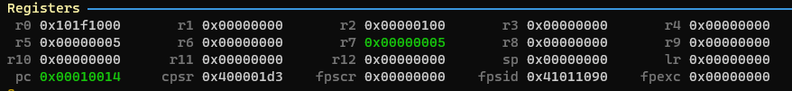
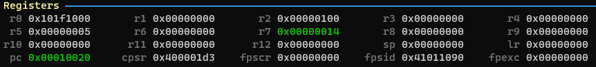
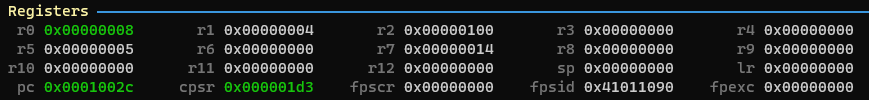
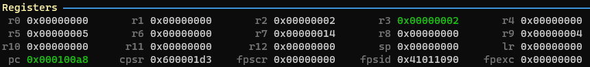
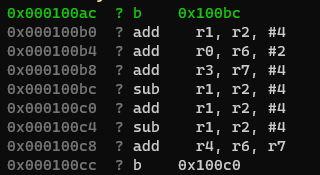
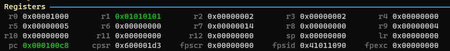
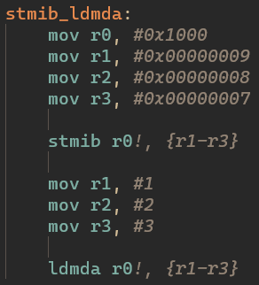

# 01\_assembly

```
$ make
$ ./debug.sh

```

## open other terminal

```
$ gdb-multiarch
$ target remote:1234
$ stepi
```

  

### mov

  

  

  

  

### barrel shifter

  

  

  

  

### movs

  

  

  

  

### sub

  

  

  

### rsb

  

  

  

### subs

  

  

  

  

### add lsl

  

  

  

  

### orr

  

  

  

### bic

  

  

  

  

### cmp

  

  

  

  

### mul

  

  

  

  

### umull

  

  

  

### b

  

  

  

  

### bl

  

  

  

### ldr str

  

  

\= hex 0x01010101  

  

  

### ldmia

  

  

  

### stmib ldmda

  

  

  

  

  

### mrs msr

  

  

  

